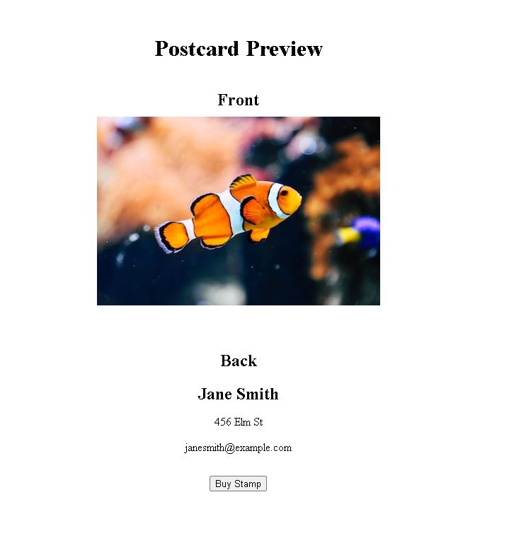

# touch-E-friends
## User Story
```md
As an aspiring world traveler with limited resources,
I want to search for iconic landmarks and vacation spots 
that are places that I would like to visit
So that I can share the images with my friends via a virtual postcard
And create a sense of awe and excitement with my friends.
```
## Table of Contents
- [Description](#description)
- [Screenshot](#screenshot)
- [Installation](#installation)
- [Usage](#usage)
- [License](#license)

## Description
Touch-E Friends is a web application that allows users to search for iconic landmarks and majestic vacation spots using a seamless integration with an image API. With just a simple touch, users can convert the images into virtual postcards that can be easily sent via email. With a simple touch, users can convert the selected image into a virtual postcard that can be easily sent via email.

## Screenshot
 

## Installation
Clone the repository to your local machine.
Navigate to the project directory.
Run the command npm install to install the necessary dependencies.
Set up the MongoDB database.
Configure the environment variables for the application.
Run the command npm start to start the application.

## Usage
When the application loads, you will be presented with a menu that includes options to search for images.  Clicking on the "image search" option will display an input field and a search button. Enter a location and click the submit button to search for images. If you are not logged in, you can still search for images, but you will not be able to access your address book.  Once you are logged in, you can access your contact information from the address book wher you will be able to add a new contact, update a contact and input your contact's information to the selected image and  generate an virtual postcard that you can email to your friend.

## License
This project is licensed under the MIT License. See the [LICENSE](LICENSE) file for more information.